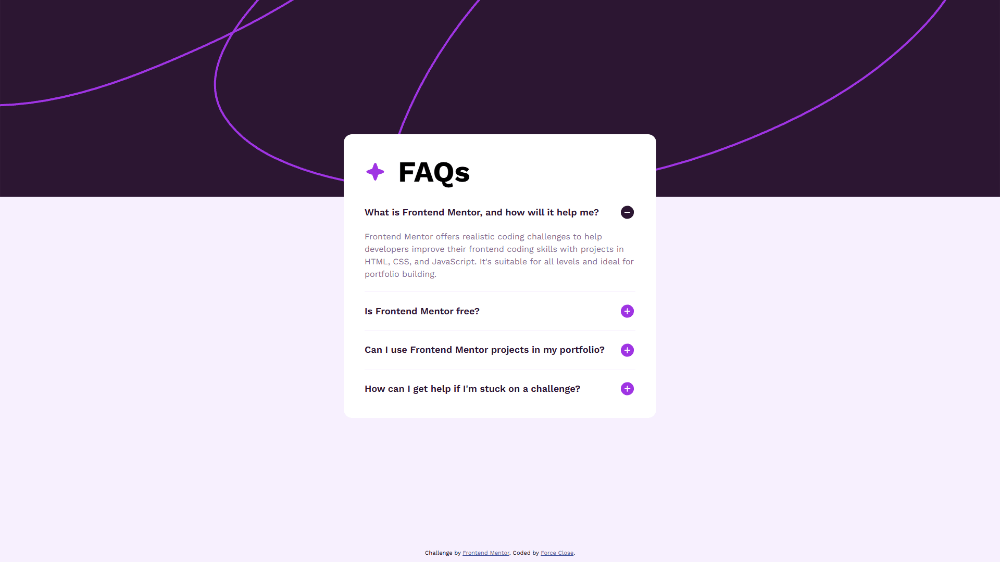

# Frontend Mentor - FAQ accordion solution

This is a solution to the [FAQ accordion challenge on Frontend Mentor](https://www.frontendmentor.io/challenges/faq-accordion-wyfFdeBwBz). Frontend Mentor challenges help you improve your coding skills by building realistic projects.

## Table of contents

- [Overview](#overview)
  - [The challenge](#the-challenge)
  - [Screenshot](#screenshot)
  - [Links](#links)
- [My process](#my-process)
  - [Built with](#built-with)
  - [What I learned](#what-i-learned)
  - [Continued development](#continued-development)
  - [Useful resources](#useful-resources)
  - [AI Collaboration](#ai-collaboration)
- [Author](#author)

## Overview

### The challenge

Users should be able to:

- Hide/Show the answer to a question when the question is clicked
- Navigate the questions and hide/show answers using keyboard navigation alone
- View the optimal layout for the interface depending on their device's screen size
- See hover and focus states for all interactive elements on the page

### Screenshot



### Links

- Solution URL: [solution URL](https://github.com/forceclosee/faq-accordion)
- Live Site URL: [live site URL](https://your-live-site-url.com)

## My process

### Built with

- Semantic HTML5 markup
- CSS custom properties
- Flexbox
- CSS Grid
- Mobile-first workflow
- Native HTML `<details>` and `<summary>` elements
- Modern CSS features (`interpolate-size`, `content-visibility`, `allow-discrete`)

### What I learned

Building an accordion without JavaScript was a great learning experience. I learned how to fully utilize the native HTML `<details>` and `<summary>` elements, which provide built-in accessibility and keyboard navigation.

I am particularly proud of implementing a smooth opening/closing animation using bleeding-edge pseudo element `details content` and transition bevavior `allow-discrete`. This allowed me to avoid JavaScript entirely while maintaining a polished UI:

```css
details::details-content {
  opacity: 0;
  block-size: 0;
  /* open / close transition */
  transition:
    content-visibility 0.5s ease allow-discrete,
    opacity 0.5s ease,
    block-size 0.5s ease;
}

details[open]::details-content {
  opacity: 1;
  block-size: auto;
}
```

### Continued development

In future projects, I want to continue exploring native HTML elements (such as `<dialog>` and the new Popover API) that can replace complex JavaScript-heavy components.
I am also interested in diving deeper into modern CSS capabilities, specifically focusing on how to provide proper fallbacks and graceful degradation for older browsers that might not yet support cutting-edge properties like `::details-content` and `allow-discrete`.

### Useful resources

- [Google Fonts](https://fonts.google.com/) - Provided the Work Sans font family used throughout the project. A great free resource for web-safe fonts.

- [TinyPNG](https://tinypng.com/) - Helped me compress and optimize the images in the project without losing quality, making the page load faster.

- [Cloudinary](https://cloudinary.com/) - Used to host the Open Graph and Twitter card images for social media sharing.

- [Perfect Pixel](https://chrome.google.com/webstore/detail/perfectpixel-by-welldonec/dkaagdgjlophiddqccjgplachon0304v) - Chrome extension that allowed me to overlay the design mockup directly on my live page for pixel-perfect accuracy.

### AI Collaboration

During this project, I collaborated with **Gemini Code Assist** to refine and optimize my code. Specifically, the AI helped me:

- **Responsive Design:** Calculate the preferred values for `clamp()` functions to seamlessly scale typography and spacing between specific breakpoints (min size breakpoint: 375px, max size breakpoint: 992px).
- **SEO & Meta Tags:** Generate comprehensive SEO, Open Graph, and Twitter Card meta tags for `index.html` to ensure the project looks professional when shared on social platforms like Discord or Twitter.
- **Documentation:** Draft and polish sections of this `README.md` to accurately reflect the modern CSS and native HTML features I utilized.

Overall, this collaboration was highly effective for streamlining complex responsive CSS calculations, speeding up SEO boilerplate creation, and clearly articulating my technical process in this documentation.

## Author

- GitHub - [Force Close](https://github.com/forceclosee)
- Frontend Mentor - [@forceclosee](https://www.frontendmentor.io/profile/forceclosee)
- X - [@forceclosee](https://x.com/forceclosee)
